### 快速上手
- 解压`.7z`压缩文件
- 打开`config.ini`，写上相关参数
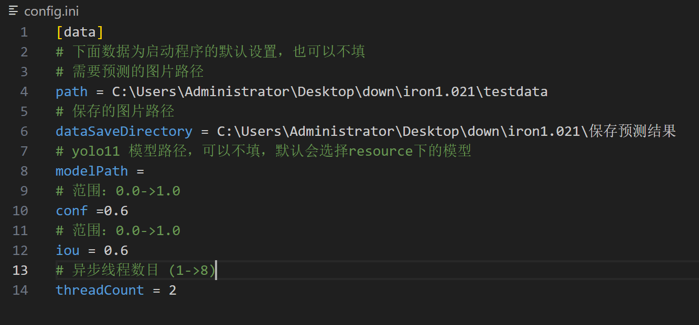
- 双击运行`.exe`文件(等待数秒后即可显示页面的logo)
- 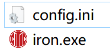
- 如果你在`config.ini`填写了默认加载的图片路径，在页面中会自动加载，等待图片加载完毕，点击`开始/继续预测...`按钮既可以开始预测。预测过程中可以暂停，暂停后点击`继续预测...`按钮继续预测，暂停后点击`停止预测...`按钮可以停止预测，停止预测后点击`开始/继续预测...`按钮可以重新开始预测。
- 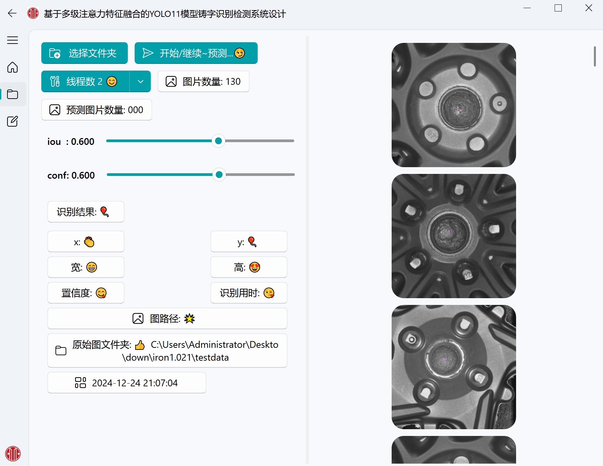
- 预测完成可以在面板左侧看见结果，显示了相关预测的信息。
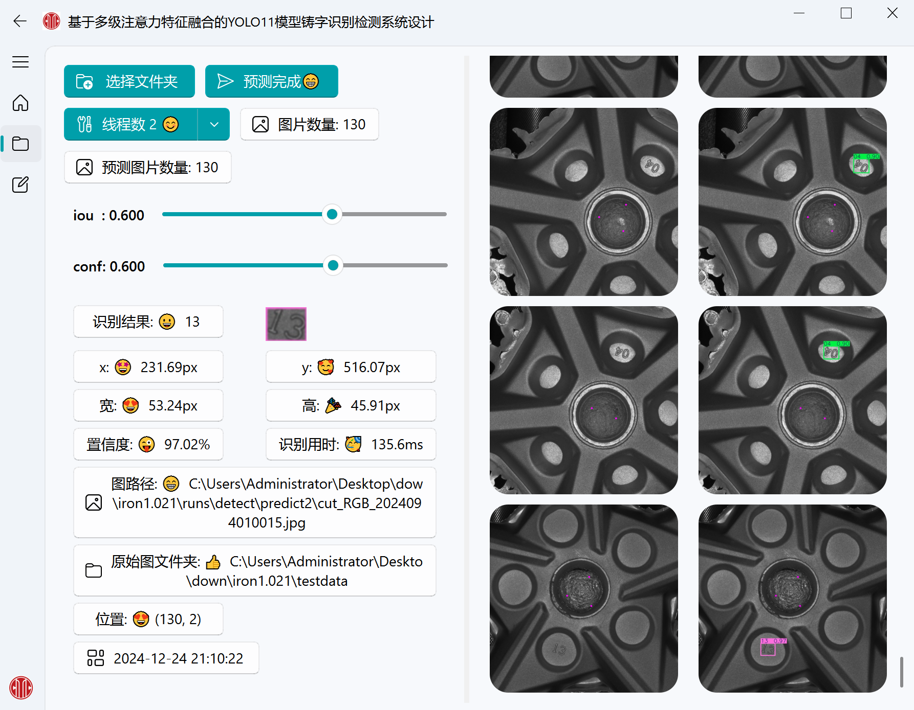
- 支持自适应窗口，可以拖动窗口大小，预测结果的图片也会自动适配，更加方便的查看结果。
- 在结果出可以看见表格，这里可以导出预测过程中的所有结果(默认会保存到`config.ini`中填入的目录,如果目录不存在，会弹出，并选择你需要保存的路径位置)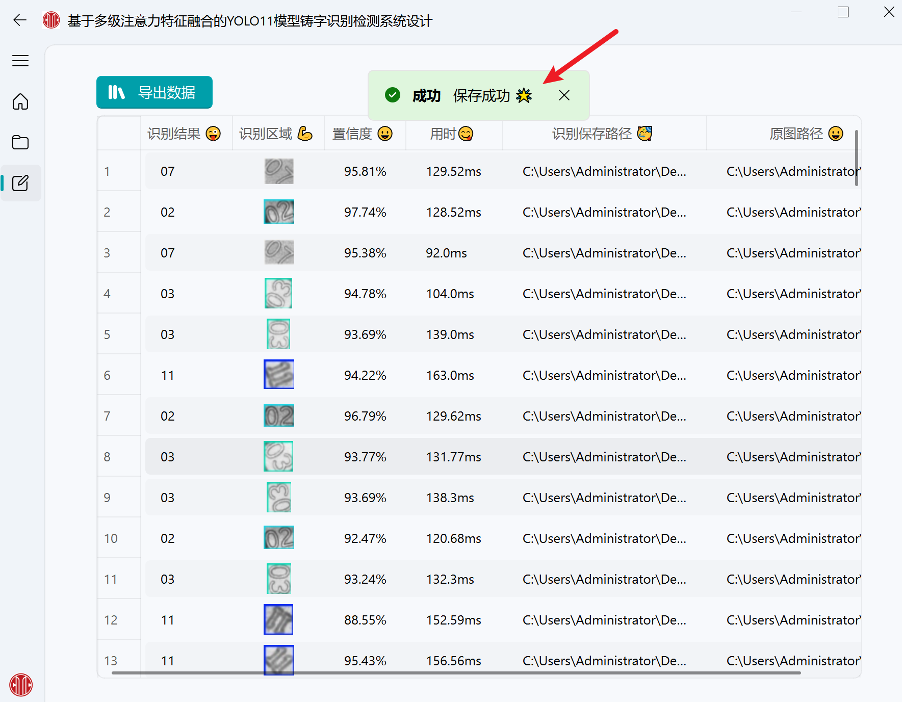
- ，当弹出保存成功后，既可以在目录中查看预测的结果和日志。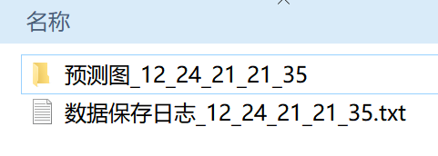

### 软件功能介绍
#### iou,conf配置作用
- **IoU** 用于评估和筛选候选框的重叠程度，确保最终输出的检测框是高质量的。
- **Conf** 用于评估和筛选候选框的置信度得分，确保模型对检测结果有较高的信心。
它们均可以通过滑块来设控制
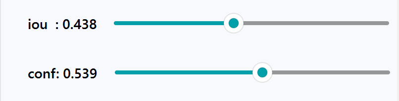
#### 线程数目控制
- 线程数目用于控制预测的并发数量。
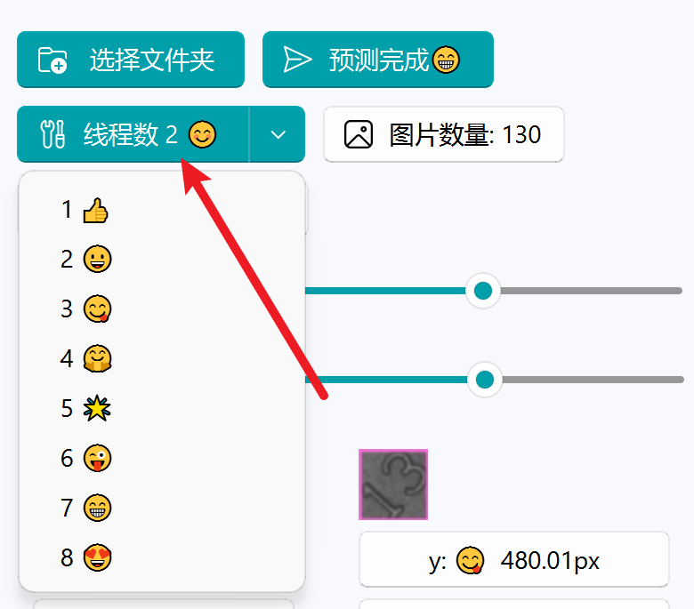

#### 预测单张图片
单击选择图片，程序会自动加载图片进行预测。在右侧面板的图片支持拖拽，放大缩小，可以跟方便的查看结果。
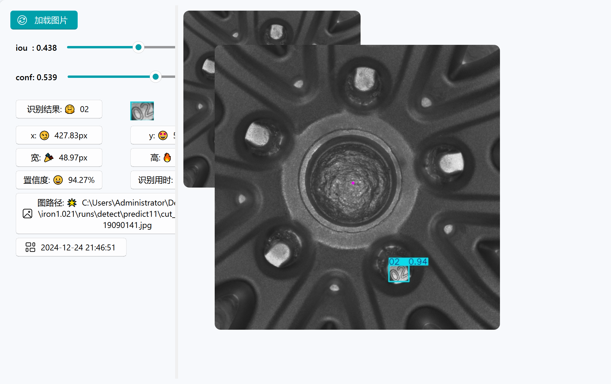

#### 预测文件夹内所有图片
单击选择文件夹，程序会自动加载文件夹中的所有图片进行预测。
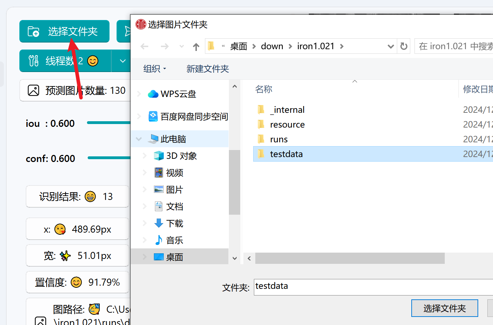
#### 预测状态
1. **加载图片**
表示在加载图片中，请耐心等待。
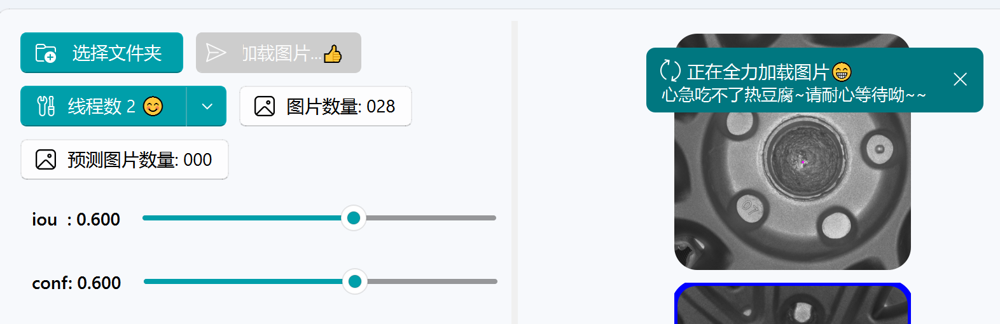
2. **开始/继续预测...**
表示当前状态可以预测，点击按钮即可开始预测。

3. **预测中...**
正在预测中，弹出的黄色警告(表示当前预测没有识别到检测框)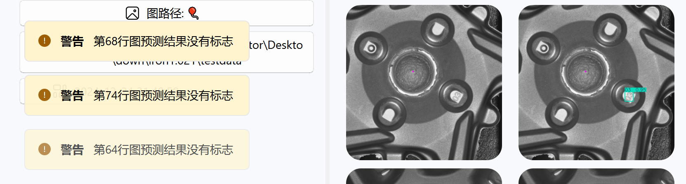
4. **正在终止所有线程...**
当在预测中，点击`预测中...`按钮时，程序会弹出此窗口，表示正在终止所有线程，暂停预测。
5. **预测完成**
表示文件夹的所有图片均已经预测完成

#### 结果
结果表格的列是可以拖动，复制的，可以更加方便的查看被遮挡的信息。
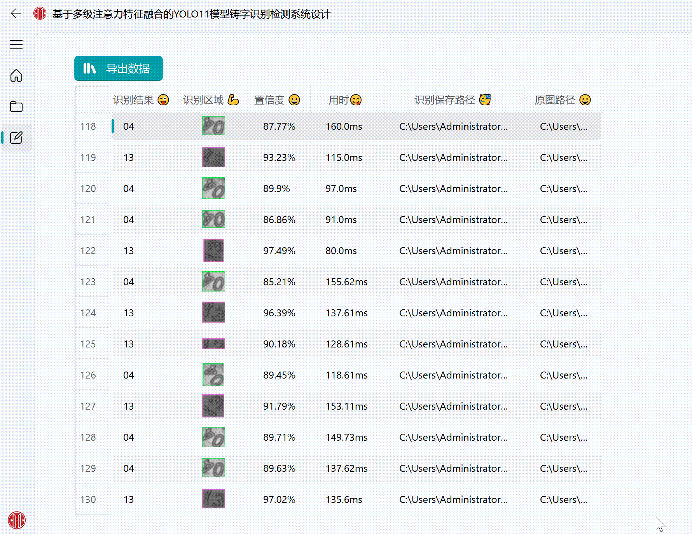

#### 导出结果
可以将结果导出到本地自选目录，保存预测结果和日志。在没有填写`config.ini`配置时，会弹出选择框，选择保存路径。
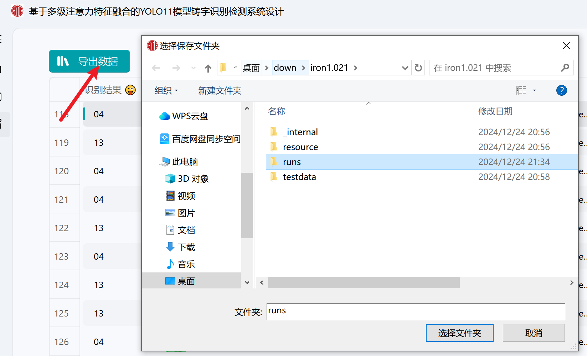
